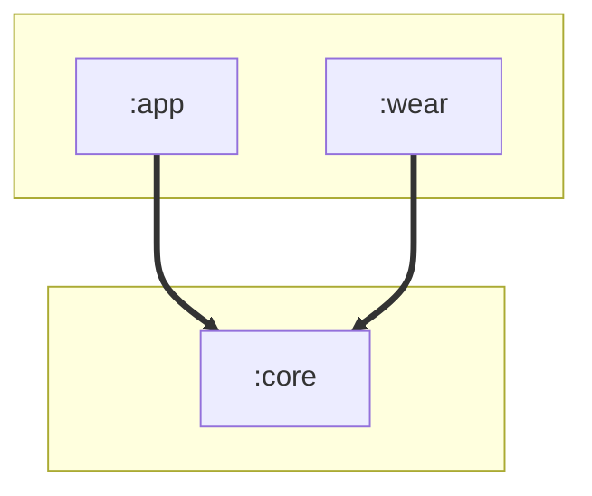
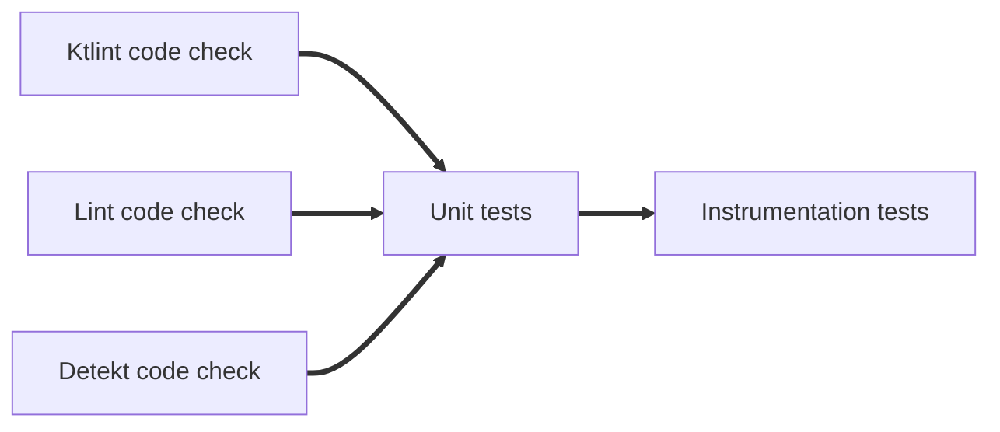
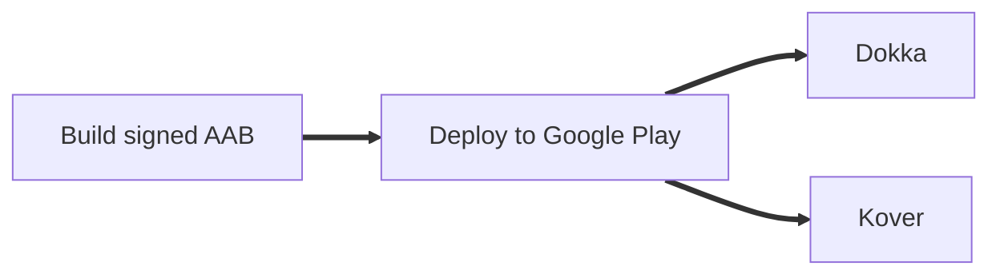

# spaceApps
## Description
This is sandbox Android project to try different things 
## Project structure

```mermaid
flowchart TB
    Core[:core]
    App[:app]
    Wear[:wear]
    subgraph  
    App
    Wear
    end
    App ==> Core
    Wear ==> Core
    subgraph  
    Core
    end
```
## CI\CD workflow
##### On PR to `master` branch

```mermaid
flowchart LR
ktlint[Ktlint code check]
lint[Lint code check]
detekt[Detekt code check]
unit[Unit tests]
inst[Instrumentation tests]
ktlint & lint & detekt ==> unit ==> inst
```
##### On push to `master` branch

```mermaid
flowchart LR
build[Build signed AAB]
deploy[Deploy to Google Play]
dokka[Dokka]
kover[Kover]
build ==> deploy ==> dokka & kover
```
